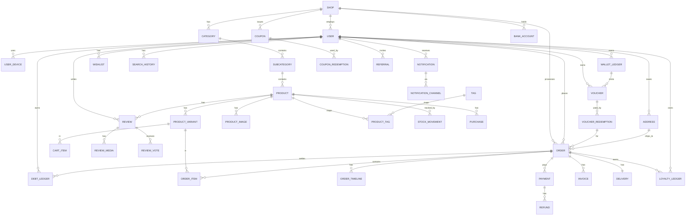

# PACHOOS — Database Design & ER Diagram (Phase 1)

> PostgreSQL 16, normalized. Every row is `shop_id`-scoped for multi-branch readiness.
> Conventions: `uuid` PKs for external-facing rows, `bigint` identity for internals where cheap; `timestamptz` for all times; soft-delete via `is_active` where relevant; audit columns on mutable tables.

## ER Diagram (Mermaid)

## Tables

### shops
| column | type | notes |
|---|---|---|
| id | bigint PK | |
| name | varchar(120) | |
| slug | varchar(140) UNIQUE | |
| address / city / state / pincode | varchar | |
| lat / lng | numeric(10,7) | branch location |
| gstin | varchar(15) | |
| phone / email | varchar | |
| timing_open / timing_close | time | |
| delivery_radius_km | numeric(5,2) | default 2 |
| free_delivery_min_order | numeric(10,2) | default 99.00 |
| delivery_charge | numeric(10,2) | default 20.00 |
| is_active | bool | |
| created_at / updated_at | timestamptz | |

### users (auth_user extends core User)
| column | type | notes |
|---|---|---|
| id | bigint PK | |
| phone | varchar(15) UNIQUE NULL | primary identifier |
| email | varchar(254) UNIQUE NULL | |
| password | varchar(128) | Argon2 hash (Google-oauth users: unusable) |
| full_name | varchar(150) | |
| role | enum(super_admin, store_manager, customer) | exactly 2 admin users exist; enforced at seed + API layer |
| shop_id | FK shops NULL | single primary shop for the 2 admins; customers are shop-agnostic |
| google_sub | varchar NULL | Google OAuth subject |
| is_verified | bool | phone verified |
| is_active | bool | |
| avatar_url | varchar | S3 |
| otp_secret / otp_sent_at / otp_attempts / locked_until | | OTP flow state |
| last_login_at / last_login_ip / last_login_ua | | |
| referral_code | varchar(12) UNIQUE | |
| referred_by_id | FK users NULL | |
| created_at / updated_at | timestamptz | |

### user_devices
| column | type | notes |
|---|---|---|
| id | bigint PK | |
| user_id | FK users | |
| refresh_token_hash | char(64) | sha256 of refresh JWT |
| device_name / platform / browser | varchar | |
| ip_address | inet | |
| user_agent | text | |
| last_seen_at | timestamptz | |
| revoked_at | timestamptz NULL | for "logout all devices" |
| created_at | timestamptz | |

### addresses
| column | type | notes |
|---|---|---|
| id | bigint PK | |
| user_id | FK | |
| label (home/office/other) | varchar(20) | |
| line1 / line2 / city / state / pincode | varchar | |
| lat / lng | numeric(10,7) NULL | geocode |
| landmark | varchar | |
| phone | varchar(15) | |
| is_default | bool | |
| created_at / updated_at | timestamptz | |

### categories
| id | bigint PK | shop_id FK | name | slug UNIQUE | image_url | display_order | is_active | created_at/updated_at |

### subcategories
| id | bigint PK | category_id FK | name | slug | image_url | display_order | is_active | timestamps |

### products
| column | type | notes |
|---|---|---|
| id | bigint PK | |
| shop_id | FK | single primary shop |
| subcategory_id | FK | |
| name | varchar(200) | |
| slug | varchar(220) UNIQUE | |
| description | text | |
| ingredients | text | |
| nutritional_info | jsonb | |
| brand | varchar(120) | |
| sku | varchar(64) | |
| barcode | varchar(64) UNIQUE NULL | |
| base_price | numeric(10,2) | |
| discount_percent | numeric(5,2) default 0 | |
| gst_percent | numeric(5,2) default 0 | |
| stock_quantity | int default 0 | denormalized; movements are source of truth |
| low_stock_threshold | int default 5 | |
| freshness | enum(fresh, frozen, bakery, dry) | drives "Fresh / Bakery / Fruit" filter |
| is_available | bool | out-of-stock flag |
| video_url | varchar NULL | |
| avg_rating | numeric(2,1) default 0 | denormalized |
| rating_count | int default 0 | denormalized |
| times_sold | int default 0 | denormalized for "popularity" |
| is_featured | bool | |
| created_at / updated_at | timestamptz | |

### product_variants
| id | bigint PK | product_id FK | name (e.g. "500g") | sku | barcode | price | discount_percent | stock_quantity | is_active | timestamps |

### product_images
| id | bigint PK | product_id FK | image_url | alt_text | sort_order | is_primary | created_at |

### tags
| id | bigint PK | name varchar(60) UNIQUE |
### product_tags
| id | bigint PK | product_id FK | tag_id FK | — (unique pair)

### stock_movements (source of truth for inventory)
| id | bigint PK | product_id FK | variant_id FK NULL | quantity int (signed) | reason enum(sale, purchase, restock, adjustment, return) | ref_order_id FK NULL | ref_purchase_id FK NULL | note | created_by_id FK NULL | created_at |

### purchases (admin stock intake)
| id | bigint PK | shop_id FK | supplier varchar | invoice_ref varchar | total_amount | purchased_at | note | created_by_id | created_at |

### purchase_items
| id | bigint PK | purchase_id FK | product_id FK | variant_id FK NULL | quantity | unit_cost | total |

### carts
| id | bigint PK | user_id FK NULL (guest) | shop_id FK | device_session varchar NULL (guest) | is_active bool | created_at/updated_at |

### cart_items
| id | bigint PK | cart_id FK | variant_id FK | product_id FK | quantity | unit_price (snapshot) | created_at |

### coupons
| id | bigint PK | shop_id FK | code UNIQUE | kind enum(percent, flat, bogo) | value numeric | min_order_amount | max_discount | valid_from | valid_to | usage_limit | used_count | is_active | created_at |

### coupon_redemptions
| id | bigint PK | coupon_id FK | order_id FK NULL | user_id FK | redeemed_at | (unique coupon+user for per-user cap if set)

### vouchers
| id | bigint PK | user_id FK | shop_id FK | code char(12) UNIQUE | amount numeric(10,2) = 10.00 | minted_from_ledger_id FK NULL | status enum(active, used, expired, void) | expires_at | created_at | used_at |

### voucher_redemptions
| id | bigint PK | voucher_id FK | order_id FK | user_id FK | amount_used | redeemed_at |

### wallet_ledger (cashback — ledger only, never spendable directly)
| id | bigint PK | user_id FK | shop_id FK | delta numeric(10,2) (signed) | balance_after numeric(10,2) | reason enum(purchase_cashback, voucher_mint, adjustment) | ref_order_id FK NULL | ref_voucher_id FK NULL | note | created_at |

### orders
| id | bigint PK | shop_id FK | user_id FK | order_number char(14) UNIQUE (e.g. PCH-YYYYMMDD-####) |
| status enum(pending, accepted, preparing, packed, out_for_delivery, delivered, cancelled, refunded) |
| subtotal | discount_total | delivery_charge | tax_total | grand_total | numeric |
| payment_status enum(pending, paid, failed, refunded, partially_refunded) |
| coupon_id FK NULL | coupon_discount |
| voucher_id FK NULL | voucher_discount |
| delivery_address_id FK | distance_km numeric(6,2) | delivery_free bool |
| delivery_eta datetime NULL |
| cashback_earned numeric(10,2) | cashback_credited_at NULL |
| cancellation_reason | cancelled_at |
| created_at | updated_at |

### order_items
| id | bigint PK | order_id FK | product_id FK | variant_id FK NULL | product_name (snapshot) | variant_name | quantity | unit_price | discount | gst_percent | gst_amount | line_total |

### order_timeline (immutable)
| id | bigint PK | order_id FK | status varchar | note | actor_user_id FK NULL | actor_role | created_at |

### deliveries
| id | bigint PK | order_id FK | partner_name | partner_phone | assigned_at | picked_up_at | delivered_at | proof_url | notes |

### payments
| id | bigint PK | order_id FK | user_id FK | razorpay_order_id | razorpay_payment_id | razorpay_signature | method enum(upi, card, netbanking, wallet, emi) | amount | status enum(created, authorized, captured, failed, refunded) | attempts int | webhook_received_at | webhook_verified bool | raw_response jsonb | created_at |

### refunds
| id | bigint PK | payment_id FK | razorpay_refund_id | amount | status enum(pending, processed, failed) | reason | initiated_by_id FK | created_at |

### invoices
| id | bigint PK | order_id FK UNIQUE | invoice_number varchar UNIQUE | gstin_shop | gstin_customer NULL | pdf_url | base_amount | tax_total | grand_total | generated_at |

### debts (customer ledger)
| id | bigint PK | user_id FK | shop_id FK | order_id FK NULL | delta numeric(10,2) (signed) | balance_after | reason enum(opened, purchase, payment, adjustment) | note | created_by_id FK | created_at |

### reviews
| id | bigint PK | user_id FK | product_id FK | variant_id FK NULL | order_id FK NULL | rating int(1-5) | title | body | is_verified_purchase bool | status enum(pending, approved, rejected) | helpful_count | created_at |

### review_media
| id | bigint PK | review_id FK | media_type enum(image, video) | url |

### review_votes (like/report)
| id | bigint PK | review_id FK | user_id FK | kind enum(helpful, report) | created_at | (unique review+user+kind)

### product_questions
| id | bigint PK | product_id FK | user_id FK | question text | answer text NULL | answered_by_id FK NULL | answered_at | created_at |

### notifications
| id | bigint PK | user_id FK | kind enum(order_update, payment_success, wallet, voucher, low_stock, admin_alert) | channel enum(sms, email, push, whatsapp) | title | body | template_id | payload jsonb | status enum(queued, sent, failed) | sent_at | read_at | created_at |

### search_history
| id | bigint PK | user_id FK | query | searched_at | result_count |

### trending_searches (cached aggregate)
| id | bigint PK | query | count | day date | shop_id FK | (unique query+day+shop)

### wishlist_items
| id | bigint PK | user_id FK | product_id FK | created_at | (unique user+product)

### recently_viewed
| id | bigint PK | user_id FK | product_id FK | viewed_at | (unique user+product)

### referrals
| id | bigint PK | referrer_id FK | invitee_id FK | code | status enum(pending, rewarded) | reward_amount | reward_order_id FK NULL | created_at |

### loyalty_ledger
| id | bigint PK | user_id FK | delta int (signed) | balance_after | reason enum(purchase, referral_bonus, redemption, adjustment) | ref_order_id FK NULL | created_at |

### bank_accounts
| id | bigint PK | shop_id FK | bank_name | account_number_encrypted (AES-GCM) | ifsc | is_active | added_by_id | consent_token_hash NULL | consent_valid_until NULL | created_at |

### bank_transactions (consent-based sync; AA API)
| id | bigint PK | bank_account_id FK | external_txn_id UNIQUE | date | description | amount (signed) | balance_after | raw jsonb | created_at |

### audit_logs
| id | bigint PK | user_id FK NULL | action varchar | entity_type varchar | entity_id varchar | before jsonb | after jsonb | ip inet | ua text | created_at | (indexed on entity_type+entity_id, user, created_at)

### activity_logs (customer-facing history)
| id | bigint PK | user_id FK | activity_type varchar | description | ref_order_id FK NULL | metadata jsonb | created_at |

### ai_chats
| id | bigint PK | user_id FK | role enum(customer, admin) | shop_id FK | title | created_at |

### ai_messages
| id | bigint PK | chat_id FK | role enum(user, assistant) | content text | tool_used varchar NULL | created_at |

## Indexing Strategy
- All FKs → btree index.
- `products`: `(shop_id, subcategory_id)`, `(shop_id, is_available)`, `(slug)` unique, `(name)` gin_trgm for search, `(avg_rating DESC)`.
- `orders`: `(shop_id, status)`, `(user_id, created_at DESC)`, `(order_number)` unique.
- `wallet_ledger` / `debt_ledger`: `(user_id, created_at DESC)`.
- `stock_movements`: `(product_id, created_at)`.
- `audit_logs`: `(entity_type, entity_id)`, `(user_id, created_at)`.
- `trending_searches`: `(shop_id, day)`.
- Search uses `pg_trgm` GIN indexes; analytics uses materialized daily snapshots.

## Money Rules (business invariants enforced in DB/services)
1. `wallet_ledger.balance_after` is monotonically consistent — computed in a `SELECT ... FOR UPDATE` transaction.
2. Voucher mint: single DB transaction per user — balance check, decrement, voucher insert. Idempotent (voucher linked to ledger row).
3. Order placement: stock deduct + voucher/coupon consume in one transaction; failure rolls back everything.
4. All money columns `numeric(10,2)`; currency `INR`; no floats.
5. Debt ledger `balance_after` derived like wallet; admin adjustments require `note` and audit entry.

## Staff Invariants
1. Exactly two staff rows exist: one `super_admin` and one `store_manager` (seeded, protected from deletion/role change via the service layer).
2. Only these two roles may mutate catalog/inventory/coupon/debt/bank data; every other request is a customer with read-only catalog + their own transactional data.
3. No per-shop staff: staff are not scoped by `shop_id` beyond the single primary shop.
